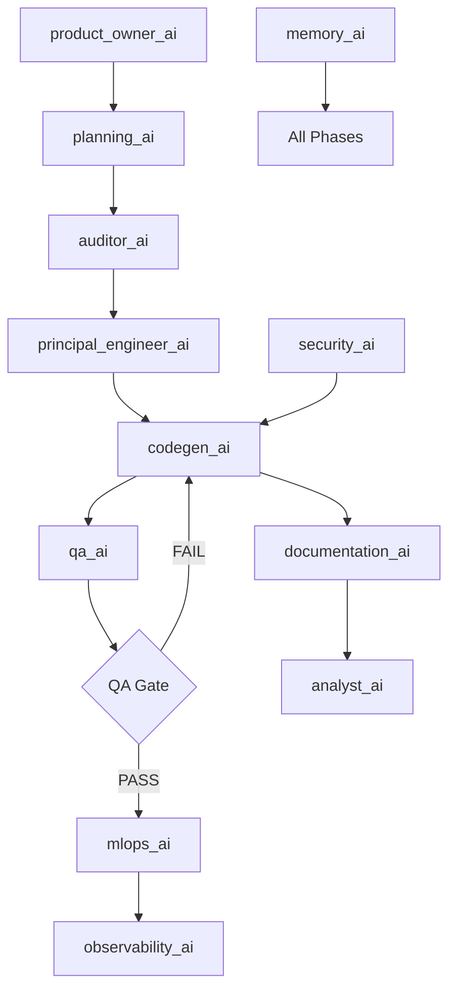
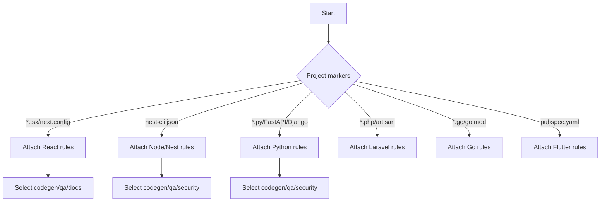

## AI Orchestration System Architecture

### Mission
Create an intelligent multi-agent AI development system that combines role-based specialists with framework-specific knowledge.

### Core Components
- execution_orchestrator.mdc: pipeline, gates, rule loading, handoffs
- rules_master_toggle.mdc: role activation and routing
- memory_ai.mdc: knowledge base, learning signals, pattern library
- framework_memory_bridge.mdc: sync with memory-bank system
- guidance_phase_awareness.mdc: phase detection and adjacent steps

### Framework Rules (Auto-Attach via Globs)
- Frontend: React, Vue, Angular, Svelte
- Backend: Node/Nest, Python/FastAPI/Django, PHP/Laravel, .NET, Go
- Mobile: React Native, Flutter, Ionic
- Specialized: Blockchain, AI/ML

### Pipeline Diagram

### Rule Application Decision Tree

### Context Switching Logic
- Orchestrator persists `workflow_state.json` and `handoff_log.json`.
- Memory signals saved to `pattern_library.json` after QA Gate PASS.
- Bridge syncs attach logs to memory-bank observability.

