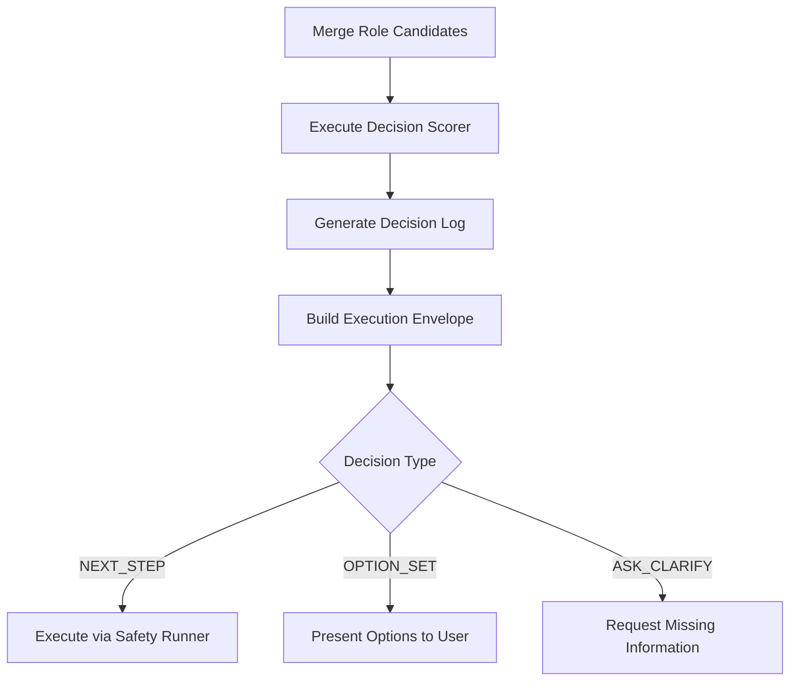

# Decision Scoring + Safe Execution Integration Guide

## Overview
This guide documents the hand-off implementation of the Decision Scoring + Safe Execution system for GPT-5 orchestration.

## Architecture

### Core Components
- **Decision Scorer (v3)** (`tools/decision_scoring/advanced_score.py`): calibrated, exploration+shadow
- **Safety Runner** (`tools/decision_scoring/execute_envelope.sh`): Executes actions in controlled environment
- **Envelope Builder**: Creates execution envelopes based on scoring decisions
- **Logging System**: Maintains decision logs in `logs/decisions/`; metrics in `logs/decision_metrics.json`
- **Provenance** (`tools/artifacts/hash_index.py`): content hashes in `memory-bank/artifacts_index.json`
- **Rule Attach Log** (`tools/rule_attach/detect.py`): append-only `rule_attach_log.json`
- **State Engine** (`tools/orchestrator/state.py`): `workflow_state.json` with idempotent transitions

### Decision Flow


## Usage

### 1. Prepare Candidates
Create `decision_candidates.json` with the following schema:
```json
{
  "context": {
    "summary": "Brief description of current context",
    "evidence_paths": ["file://path/to/evidence"]
  },
  "candidates": [
    {
      "id": "unique_action_id",
      "action_type": "NATURAL_STEP|COMMAND_TRIGGER",
      "explanation": "Why this action is appropriate",
      "preconds": ["condition1", "condition2"],
      "metrics": {
        "intent": 0.0,
        "state": 0.0,
        "evidence": 0.0,
        "recency": 0.0,
        "pref": 0.0
      },
      "command": "optional command for COMMAND_TRIGGER"
    }
  ]
}
```

### 2. Execute Decision Scoring (v3)
```bash
python3 tools/decision_scoring/advanced_score.py
# or programmatically
python3 - << 'PY'
from tools.decision_scoring.advanced_score import score_candidates
c=[{"id":"plan","action_type":"COMMAND_TRIGGER","risk":"LOW","scores":{"intent":0.9,"state":0.7,"evidence":0.6,"recency":0.4,"pref":0.5,"cost":0.2,"risk_penalty":0.1}},
   {"id":"ask","action_type":"NATURAL_STEP","risk":"LOW","scores":{"intent":0.78,"state":0.7,"evidence":0.6,"recency":0.5,"pref":0.4,"cost":0.0,"risk_penalty":0.0}}]
print(score_candidates(c, explore=True, shadow=True))
PY
```

### 3. Build Execution Envelope
Based on decision type:
- **NATURAL_STEP**: Create PLAN_ONLY envelope, update `next_prompt_for_cursor.md`
- **COMMAND_TRIGGER**: Create DRY_RUN envelope with `echo DRY_RUN:` prefix

### 4. Execute via Safety Runner
```bash
tools/decision_scoring/execute_envelope.sh action_envelope.json
```

## Scoring System

### Metrics (0.0 - 1.0 scale)
- **Intent**: Alignment with user goals and context
- **State**: Current system state compatibility
- **Evidence**: Supporting documentation and artifacts
- **Recency**: Temporal relevance of information
- **Preference**: User/system preferences and priorities

### Weights/Thresholds/Calibration
```json
// tools/decision_scoring/weights.json
{"intent":0.30,"state":0.25,"evidence":0.20,"recency":0.15,"pref":0.10,"cost":-0.10,"risk_penalty":-0.20}

// tools/decision_scoring/thresholds.json
{"conf_high":0.75,"conf_mid":0.55,"eps_gap":0.05}

// tools/decision_scoring/calibration.json
{"alpha":1.0,"beta":0.0}
```

### Decision Gates
- **CONF_HIGH** (≥0.75): Execute NEXT_STEP
- **CONF_MID** (0.55-0.75) with gap ≤ ε: Present OPTION_SET
- **CONF_LOW** (<0.55): ASK_CLARIFY

## Safety Features

### DRY_RUN Mode
- Commands prefixed with `echo DRY_RUN:`
- Preview execution without side effects
- Manual approval required for real execution

### Envelope Validation
- Precondition checking before execution
- Command sanitization and validation
- Execution environment isolation

## Implementation Example

### Current Hand-off Results
- **Decision**: NEXT_STEP
- **Chosen Action**: validate_system_readiness
- **Score**: 0.873 (CONF_HIGH)
- **Execution Mode**: DRY_RUN

### Generated Artifacts
- Decision Log: `logs/decisions/20250828_142955.json`
- Execution Envelope: `action_envelope.json`
- Safety Runner Output: Command preview without execution

## Best Practices

### Candidate Creation
1. Ensure metrics are calibrated [0,1]
2. Cite real file paths for evidence
3. Include specific preconditions
4. Use descriptive, actionable IDs

### Execution Safety
1. Always use safety runner for command execution
2. Validate envelopes before execution
3. Log all decisions and outcomes
4. Implement fail-closed for destructive operations

### Monitoring
1. Track decision quality metrics
2. Monitor scoring distribution
3. Audit execution outcomes
4. Update weights based on performance

## Troubleshooting

### Common Issues
- **No candidates provided**: Ensure `decision_candidates.json` exists and is valid JSON
- **Missing tools**: Verify `tools/decision_scoring/` directory structure
- **Precondition failures**: Check file paths and system state
- **Scoring errors**: Validate metrics are numeric [0,1]

### Debug Commands
```bash
# Test scoring system
python3 tools/decision_scoring/score.py tools/decision_scoring/weights.json < tools/decision_scoring/examples/test_input.json | jq '.decision'

# Validate envelope
tools/decision_scoring/execute_envelope.sh action_envelope.json

# Check artifacts
ls -la memory-bank/business/
```

## Integration Points

### With Existing Systems
- **Memory Bank**: Provides context and evidence
- **Rules Engine**: Supplies candidate generation logic
- **Orchestrator**: Coordinates multi-step workflows
- **Logging**: Centralized audit trail

### Extension Points
- Custom scoring algorithms
- Additional safety checks
- Alternative execution environments
- Integration with external tools

---

**Status**: ✅ IMPLEMENTED AND VALIDATED
**Decision Log**: `logs/decisions/20250828_142955.json`
**Metrics**: `logs/decision_metrics.json`
**Provenance**: `memory-bank/artifacts_index.json`
**Rule Attach**: `rule_attach_log.json`
**Safety**: ✅ DRY_RUN execution confirmed
**Documentation**: Complete integration guide created
