# Rules, Scripts, and Process Flow Documentation

This document records the complete sequence of rules, tools, and actions triggered since the command: "[cursor-rules:on] Ingest mo ang plan".

## Timeline of Events

1. Rules Activation
   - Trigger: `[cursor-rules:on]`
   - Effect: Cursor rules enabled; automation protocols active.

2. Plan Ingestion Request
   - Trigger: `Ingest mo ang plan`
   - Action: Read frozen source `memory-bank/plan/organize.md`.
   - Outcome: Parsed testing directives for user authentication (unit, integration, performance; pytest; AAA; fixtures; mocking).

3. Human-Readable Plan Draft
   - Constructed 6 phases:
     0. Setup & Protocol
     1. Test Framework Setup & Analysis
     2. Unit Tests
     3. Integration Tests
     4. Performance Tests
     5. Validation & Documentation
   - Each phase includes: Explanations, Concluding Step (commands), IMPORTANT NOTE.

4. Approval
   - Trigger: `approved`
   - Action: Convert draft to JSON-ready content following `tasks_active_schema.mdc`.
   - Resulting ID (content-only output): `user_auth_testing_actionable_20250127`.

5. Validation Gate: Next Phase Analyzer
   - Command:
     ```bash
     python3 plan_next.py
     ```
   - Observed: Existing active task `organized_actionable_20250816`; next phase index 0; lint OK; IMPORTANT NOTE present.

6. Hierarchy View: Plan Structure
   - Command:
     ```bash
     python3 plain_hier.py organized_actionable_20250816
     ```
   - Observed: 6 phases, 0/6 done; commands preview for each phase.

7. Proceed Protocol (when user says "proceed")
   - Actions:
     1) Identify next phase
        ```bash
        python3 plan_next.py
        ```
     2) If a specific sub-step is shown, execute it
        ```bash
        python3 todo_manager.py exec <TASK_ID> <SUB_INDEX>
        ```
     3) Show the updated status
        ```bash
        python3 todo_manager.py show <TASK_ID>
        ```
   - Current context: Ready to operate on Phase 0 for `organized_actionable_20250816`.

8. Documentation Creation
   - Created: `memory-bank/DOCUMENTS/flow_overview.md` (this file)
   - Created: `memory-bank/DOCUMENTS/flow_diagram.mmd` (Mermaid source)

## Current System State

- Active Task: `organized_actionable_20250816` (0/6 done)
- New Plan (content-only, awaiting system ingestion window): `user_auth_testing_actionable_20250127`
- Constraint: Single active task at a time; no direct writes to queue/state files.

## Commands Reference

```bash
# Analyze next phase
python3 plan_next.py

# Show hierarchy for current task
python3 plain_hier.py organized_actionable_20250816

# Execute a sub-step if provided by the plan
python3 todo_manager.py exec <TASK_ID> <SUB_INDEX>

# Show current status
python3 todo_manager.py show <TASK_ID>
```

## Mermaid Diagram

The process diagram is stored in `memory-bank/DOCUMENTS/flow_diagram.mmd` and embedded below for quick reference.

```mermaid
graph TD
  A["User: [cursor-rules:on]"] --> B["Rules Enabled"]
  B --> C["Trigger: Ingest plan"]
  C --> D["Read memory-bank/plan/organize.md"]
  D --> E["Draft Plan (6 phases)"]
  E --> F["User: approved"]
  F --> G["Finalize JSON (content-only) user_auth_testing_actionable_20250127"]
  G --> H["Validate Gate: plan_next.py"]
  H --> I{"Existing active task?"}
  I -- "Yes: organized_actionable_20250816" --> J["plain_hier.py → 6 phases, 0/6 done"]
  J --> K["Ready for proceed protocol"]
  K --> L["On 'proceed': plan_next.py"]
  L --> M["If sub-step: todo_manager.py exec <TASK_ID> <SUB_INDEX>"]
  M --> N["Show: todo_manager.py show <TASK_ID>"]
  I -- "No" --> O["System ingests new plan as active"]
  N --> P["Documentation created under memory-bank/DOCUMENTS"]
```



---

Last updated: Auto-generated by assistant.
