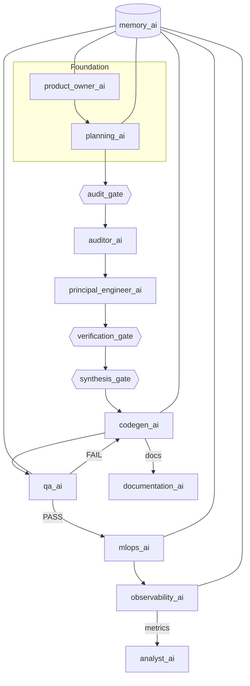

# Overview

This framework defines a multi‑role, gate‑driven workflow for AI‑assisted development.

Core concepts
- Roles: product_owner_ai, planning_ai, codegen_ai, qa_ai, mlops_ai, documentation_ai, analyst_ai, memory_ai, observability_ai, auditor_ai, principal_engineer_ai, execution_orchestrator, prompt_factory_ai.
- Routing: commands (e.g., /backlog, /plan, /gen_code, /test, /deploy, /run_pipeline) are mapped to roles via rules_master_toggle.mdc.
- Gates (BLOCK semantics): planning, code_generation, quality_assurance, deployment, audit, verification, synthesis.
- Artifacts: Action_Plan.md → Summary_Report.md → Validation_Report.md → Final_Implementation_Plan.md.

Lifecycle (high-level)
1) Backlog and planning (/backlog → /plan)
2) Audit and validation (/audit → /peer_review)
3) Synthesis (/synthesize_plan → Final_Implementation_Plan.md)
4) Execute pipeline (/run_pipeline) with gates enforcing required inputs and blocking conditions.

Environment policy
- Dev (advisory): AI_ENFORCEMENT_MODE=solo (WARN)
- CI/Prod (strict): AI_ENFORCEMENT_MODE=team (BLOCK)

References
- system-prompt/rules_master_toggle.mdc — roles, triggers, routing
- system-prompt/execution_orchestrator.mdc — pipeline, gates, handoffs, states
- examples/* — artifact templates and examples

---

## End-to-end Interaction Mapping

- Command routing (from `rules_master_toggle.mdc`):
  - /backlog → product_owner_ai → product_backlog.yaml
  - /plan → planning_ai → technical_plan.md, task_breakdown.yaml, architecture_diagram.mermaid
  - /audit → auditor_ai → Summary_Report.md
  - /peer_review, /synthesize_plan → principal_engineer_ai → Validation_Report.md, Final_Implementation_Plan.md
  - /gen_code → codegen_ai → source files + tests
  - /test → qa_ai → test_results.json (+ coverage)
  - /deploy → mlops_ai → deployment_manifest.yaml (+ release report)
  - /observe → observability_ai → dashboards, alerts
  - /review → analyst_ai → analysis_report.md
  - /snapshot | /recall | /learn → memory_ai → knowledge base, decision log, snapshots
  - /run_pipeline | /status → execution_orchestrator → workflow state

- Gates (from `execution_orchestrator.mdc`):
  - audit_gate: requires Action_Plan.md + technical_plan.md → produces Summary_Report.md
  - verification_gate: requires Action_Plan.md + Summary_Report.md → produces Validation_Report.md
  - synthesis_gate: requires Action_Plan.md + Summary_Report.md + Validation_Report.md → produces Final_Implementation_Plan.md

- Handoffs:
  - planning_ai → auditor_ai → principal_engineer_ai → codegen_ai
  - codegen_ai → qa_ai → mlops_ai → observability_ai
  - documentation_ai runs parallel from codegen; analyst_ai runs after deploy via observability

- Memory bridge (from `framework_memory_bridge.mdc`):
  - framework_todos → memory-bank/queue-system/tasks_active.json (append)
  - role outputs → memory-bank/project-brain/
  - execution logs → memory-bank/logs/
  - existing CLIs remain primary; framework adds gating and routing

## Diagram

